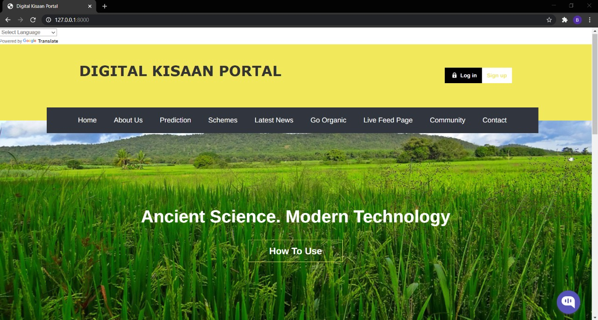
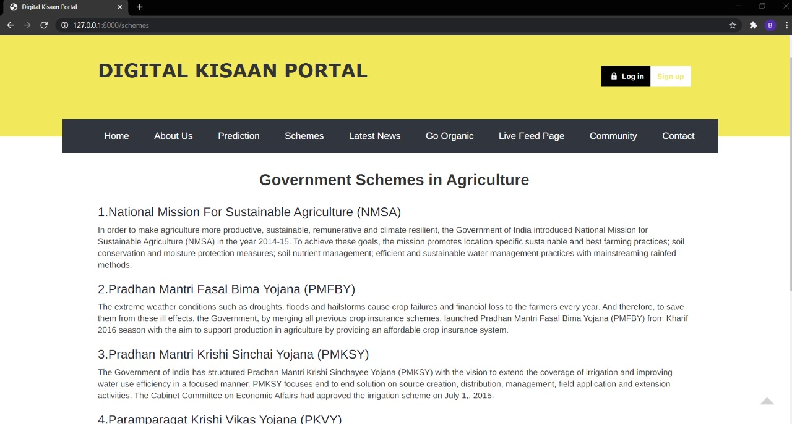
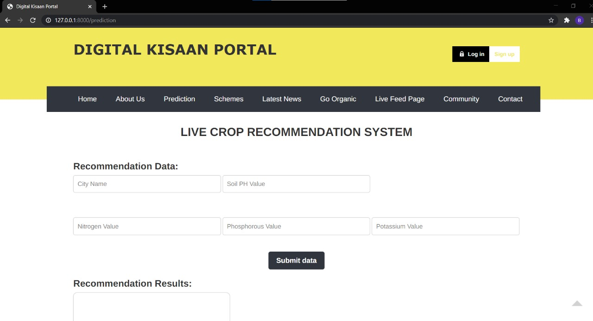
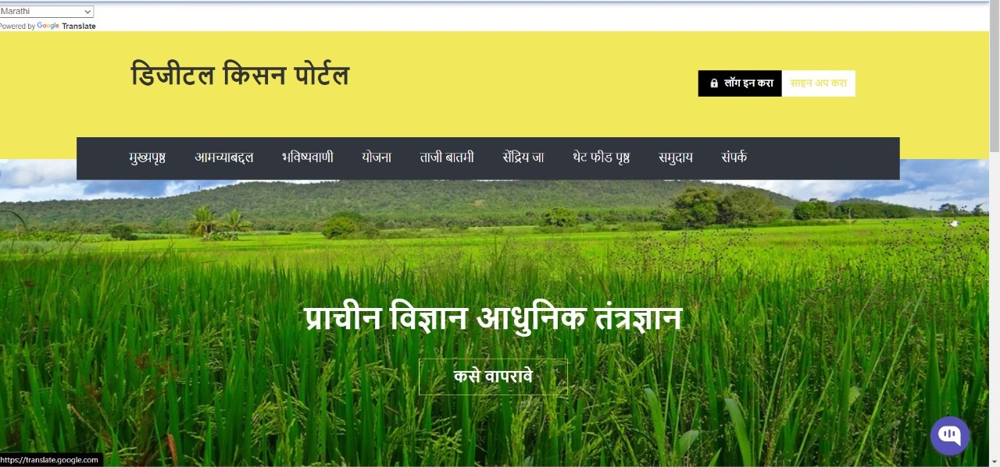

# Digital-Kisaan-Portal


A web application designed to support farmer-community with Intelligent Machine Learning technologies, providing live crop recommendation and prediction system, facilitating farmers with online community support and chat bot based on Artificial Intelligence. It also Integrates an on-demand news feed page aiding for socialising within the farmer community. 


## Contributors

* [Akshat Chandak](https://github.com/chandakakshat)
* [Sakshi Nema](https://github.com/sakshinema)
* [Shreyas Nemani](https://github.com/superb-shreyas)
* [Shubham Manikant Jha](https://github.com/shubhamjha-cse)

## Abstract


India has enough food; does it have too many people working in agriculture? The pressure on land is an outcome of policy, which condemns most people to marginal farming. India needs a different set of solutions for agriculture and for those working the land. Therefore, It is high time for introducing Intelligent technologies into Agriculture to gain “Precision Agriculture”.

With the help of Digital Kisaan Portal we address the problems faced using Live crop prediction and recommendation for precise agricultural practices with a growing support community to help farmers with their day to day challenges and also socializing their success.


## Dataset

The dataset is in the form of CSV file  containing features such as N, P, K, Value, Temperature, Humidity, pH and Crops.


## Modules Implemented

🤖 **Chat Bot**

It’s an AWS LEX Chat bot for aiding users with their immediate queries regarding website and engages farmers more efficiently 
Amazon Lex provides the advanced deep learning functionalities of automatic speech recognition (ASR) for converting speech to text, and natural language understanding (NLU) to recognize the intent of the text

💻 **Recommendation System**  
  
In Agriculture, mostly crops are loss due to the erroneous selection of the crop to be grown in a particular land holding. The farmers can obtain a data about their surroundings i.e. the minerals, soil moisture and ph, (N P K) values and Temperature. But a lot of times they end up cultivating wrong crops. This can cause a distress to farmer both mentally and financially.
This problem of farmer is addressed in our design issue and we have tried to solve it with the help of a Recommendation System. 

❤️ **Communtity Build**  

This is the self-growing platform where farmers can post their day to day challenges faced and other people and experts can provide them or post solutions for issues.

💰 **Government Schemes**  

This keeps farmers informed about state intended government schemes and subsidies for availing benefits with the complete procedure to apply  

📰 **News Feed**  

This is the platform where farmers can share and give views about different emerging technologies and they can also share and socialize their success using this platform


## Salient Features


* Crop Prediction
* Live Crop Recommendation : Accuracy 99.75%
* Chat Bot
* Continuous data for crop prediction data
* Online Community Support 
* Social News feed page
* Detailed State Intended government scheme and subsidies 
* User Friendly Application
* Available in 250+ languages
* Organic Farming Portal


## Dependancies

The following python frameworks are used
* ```Django```


The following python libraries are required for Machine Learning
* ```pandas```
* ```scikit-learn```

~~~
pip install pandas
pip install scikit-learn
~~~

You can also install it from here :

[Pandas](https://pandas.pydata.org/)  
[Scikit-learn](https://scikit-learn.org/stable/install.html)

## Screenshots







##  License

[](https://www.gnu.org/licenses/gpl-3.0)

This Project is open source, intended for NMIT Hackathon, protected under [GNU GPL v3](https://opensource.org/licenses/MIThttps://www.gnu.org/licenses/gpl-3.0) license.
